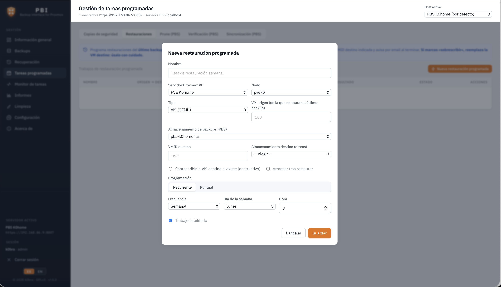

<div align="center">

# PBI · Backup interface for Proxmox

**Free, self-hosted web interface to manage [Proxmox Backup Server](https://www.proxmox.com/proxmox-backup-server).**

[Español](README.md) · **English**

Free software (GPLv3) · Independent project, not affiliated with Proxmox.

</div>

---

PBI brings everything you need to operate your Proxmox Backup Server (PBS) backups into a
single, clean, professional interface: see their status at a glance, recover machines or
files, schedule jobs, generate compliance reports, clean up stale backups and get email
alerts — without jumping between the PBS and Proxmox VE consoles.

The **backend** acts as a secure proxy in front of the PBS and Proxmox VE APIs: it
handles self-signed certificates, stores credentials **encrypted** on the server only
(never returning them to the browser) and supports both PBS authentication modes (API
token or username/password). Panel access is protected with **username, password and
optional 2FA**, and the interface is available in **Spanish and English**.

## ✨ Features

### Overview (Dashboard)
Panel: datastore, snapshot, protected-group and failed-verification counts; **protected
devices** by type (VM / CT / Host); a **monthly, navigable backup calendar** (arrows to
change month) showing the **number of backups per day**, colour-coded (successful /
partial / failed / no backup) with today highlighted; **storage with two donuts** (physical
NAS usage and the total logical size of all backups with the deduplication factor); latest
backups; recent activity; and a daily transfer trend. The **week start** (Monday/Sunday) is
configurable.

### Backups
A per-datastore **snapshot** explorer with filtering by id/owner/comment, verification
status and size. **Encrypted** column with a 🔒 badge per snapshot (read from the
`crypt-mode` field returned by PBS) and an encrypted-snapshot counter in the summary.
**CSV** export.

### Recovery
Guided restore through Proxmox VE, without touching the console:
- **Full VM/CT**: pick the machine → restore point → target node, disk storage and
  VMID, with **overwrite** and **start after restore** options. **Live** task log.
- **Files (granular)**: browse inside the backup and download specific files or folders
  (ZIP).

### Scheduled tasks
- **Backups (Proxmox VE)**: create/edit/delete *vzdump* jobs with templates (daily, GFS,
  etc.), machine selection, retention, PBS target and **encryption** option (`encrypt`).
  An integrated **Help** button explains how to configure the encryption key in PVE (GUI
  and CLI) and how to restore encrypted backups on a different cluster.
- **Scheduled restores**: recurring **restore tests** (restore a VM's latest
  backup to a test VMID to validate that your backups are recoverable) or **one-off**
  restores at a future date/time. Per-job target (test VMID or overwrite, flagged as
  dangerous) and **email notification** when finished.
- **PBS jobs**: *prune* (retention), *verify* (integrity) and *sync* (offsite replica) —
  list, create, edit, delete and **run manually**, with templates and an explanation of
  each type.

### Task monitor
History with **auto-refresh** every 5 s, an "only running" filter and a per-task **log
viewer** that updates live. For **running backups** it shows the **percentage** and the
**vzdump log (Proxmox VE side)** — the same one you see in the Proxmox console — rather
than the PBS-side task (which reports no progress).

### Reports
- **Executive summary**: success rate, successful/failed tasks, status per datastore.
- **Evidence report (ISO 27001 / ENS)**: a complete report for a specific date range and
  machines, with audit metadata, scope, per-machine policy (RPO/retention/mode),
  encryption and offsite status, a **backup calendar with the number of backups per day**,
  the **total logical backup size and deduplication factor**, and a statement — **HTML**
  preview and **PDF** download.
- **Scheduled email report**: configurable (daily/weekly/monthly), with the HTML report
  and the **attached PDF**; lets you set the **site**.
- **CSV** exports of snapshots and task history.

### Cleanup
A **backup groups** table with **orphan detection** (backups whose VM no longer exists
in Proxmox VE), deletion by group or by snapshot — with old-backup highlighting for
**VMID reuse** cases — and **Garbage Collection** per datastore to reclaim physical disk
space.

### Email notifications
A background watcher that sends a **clean, structured** email when a task finishes
(configurable types and success/failure) and when a **restore** finishes (manual or
scheduled). The email includes:
- **Site / organisation name** in the subject, header and footer (read from the reports configuration).
- **Backup type**: PBS category (VM / CT / Host) and Full/Incremental mode when determinable from the task log.
- **Encryption status**: "Encrypted: Yes 🔒 / No" row when the log indicates the backup was encrypted.

Notifications are **enabled by default** once SMTP is configured (host + recipient).
Option to **silence Proxmox's native notifications** (PVE and PBS) to avoid
duplicate emails. SMTP configuration with a **test email**.

### Self-update from the panel
The **Updates** button in the sidebar checks GitHub Releases and shows whether a newer
version is available. The check runs **automatically in the background** (on load and every
few hours): when a newer version exists, a **notification dot** appears on the button.
When an update is found:
- **One-click install**: asks for your PBI password (never the root password), downloads
  the `.deb`, verifies its **SHA-256** and triggers installation through a dedicated
  system service with the minimum required privileges — the web process **never
  escalates privileges**.
- **Manual SSH guide**: if you prefer to update by hand, the panel shows the ready-to-copy
  `wget` / `sha256sum` / `dpkg -i` commands.

### Security & multi-user
- **Protected access**: username/password login with optional **2FA (TOTP)**; the admin
  account is created on first run.
- **Three user roles**:
  - **Administrator**: full access and management (users, settings, audit log).
  - **Operator**: full use of the panel (backups, jobs, recovery, cleanup…).
  - **Viewer**: **read-only** access to the dashboard, backups, task monitor and reports.
    No access to jobs, settings, recovery or cleanup — enforced both in the UI and in
    the backend.
- **Action audit log**: persistent log at `/var/lib/pbi/audit.jsonl` recording every
  login/logout, user creation/modification, job run and cleanup operation. Filterable
  view by user, action and date, with **configurable rotation** (max file size and number
  of files).
- **Secrets encrypted at rest** (AES-256-GCM): PBS/PVE token secrets and the SMTP
  password are stored encrypted; never returned by the API.
- **HTTPS** with a self-signed certificate generated by the `.deb` install.

### Multi-host & language
Manage **several PBS servers** and switch between them from the top-bar selector. The
interface is available in **Spanish / English** with an ES/EN switcher that remembers
your choice and detects the browser language the first time.

## 🖼️ Screenshots & examples

Examples generated with fictitious data by PBI's own engine. GitHub shows `.html` files
as source code; to see them **rendered**, use the "view" links:

- 📄 **Monthly backup report** — [view PDF](docs/examples/informe-mensual.pdf) · [view HTML](https://htmlpreview.github.io/?https://github.com/k0braintheworld/PBI/blob/main/docs/examples/informe-mensual.html)
- ✉️ **Email notification** — [successful backup](https://htmlpreview.github.io/?https://github.com/k0braintheworld/PBI/blob/main/docs/examples/notificacion-correcta.html) · [failed backup](https://htmlpreview.github.io/?https://github.com/k0braintheworld/PBI/blob/main/docs/examples/notificacion-fallo.html)

> The PDF renders natively on GitHub. The "view HTML" links use
> [htmlpreview.github.io](https://htmlpreview.github.io); as a permanent alternative you
> can enable **GitHub Pages** on the repository. You can also download the HTML files and
> open them in your browser.

| Dashboard | Recovery |
|:---:|:---:|
|  |  |
| **Scheduled tasks (backup)** | **Scheduled restore** |
|  |  |

> The screenshots show the interface in Spanish; switch the language with the ES/EN toggle.

## 🚀 Installation

### Option A — `.deb` package (recommended)

Designed to be installed on the PBS itself or on any Debian/Ubuntu. It **includes
everything** needed (bundled Node runtime, systemd service and HTTPS with a self-signed
certificate): no need to install Node or any other dependency.

```bash
sudo dpkg -i pbi_<version>_amd64.deb
```

When it finishes, the installer prints the **access URL** (by default
`https://SERVER_IP:8800`). The service is managed with systemd:

```bash
systemctl status pbi      # status
journalctl -u pbi -f      # live logs
```

Configuration lives in `/etc/pbi/pbi.env` and persistent data (hosts, users, jobs,
audit log, etc.) in `/var/lib/pbi`.

> **Tip:** if you install PBI on the PBS server itself, set the host to
> `https://127.0.0.1:8007` to connect locally and avoid going through the network.

### Updating

To upgrade to a new version without losing data:

```bash
sudo dpkg -i pbi_<new_version>_amd64.deb
```

Or use the **Updates** button in the sidebar to install directly from the panel.

### Option B — From source (development)

Requirements: **Node.js 18+** (developed with v22).

```bash
npm install        # installs server + web (workspaces)
npm run dev        # starts backend (:4000) and frontend (:5173)
```

Open **http://localhost:5173**. On first access you'll create the admin account; then
it takes you to **Settings** to add your first PBS server.

For production from source: `npm run build` (builds the frontend) and then `npm start`
(the backend serves the API and the compiled frontend).

## 🧭 Getting started

### Add a PBS host

In **Settings → Proxmox Backup Server → Add host**:

- **Host**: `https://YOUR_PBS_HOST:8007`
- **Node**: the PBS node name (usually the hostname; default `localhost`).
- **Authentication mode**:
  - **API Token** (recommended): create it in PBS under *Configuration → Access Control
    → API Tokens*. Enter the *Token ID* (`user@realm!name`) and the *Secret*.
  - **Username / Password**: the backend logs in and manages the ticket + CSRF token
    automatically.
- **Verify TLS**: uncheck it if the certificate is self-signed (the norm in PBS).

Use **⚡ Test** to validate the connection. You can save several hosts and mark one as
**default**.

> **PBS permissions:** read-only needs the `DatastoreAudit` role. Creating/modifying/
> running jobs requires admin permissions (`DatastoreAdmin`, `Sys.Audit`, etc.)
> depending on the operation.

### Add a Proxmox VE connection (for recovery and backup jobs)

Restores and *vzdump* backup jobs are executed by **Proxmox VE**. In
**Settings → Proxmox VE → Add**, create an **API token** in PVE (*Datacenter →
Permissions → API Tokens*) with permissions over VMs and storage. If the token can't see
the storages, uncheck "Privilege Separation" when creating it or assign it a role (e.g.
*Administrator*) on the `/` path.

## 🔐 Security

- **Secrets encrypted at rest** (AES-256-GCM): PBS/PVE token secrets and the SMTP
  password. The key is derived from `SESSION_SECRET`, which in the `.deb` lives in
  `/etc/pbi/pbi.env`, **separate** from the data in `/var/lib/pbi` — a copy of the data
  directory is not enough to decrypt them. *(If you change `SESSION_SECRET`, stored
  secrets must be re-entered.)*
- The API **never** returns secrets (they are masked).
- Sessions are signed in an `httpOnly` cookie; optional **TOTP 2FA** per user.
- **HTTPS** with a self-signed certificate on `.deb` install (replaceable with your own
  in `/etc/pbi/pbi.env`).
- Data files are created with `600` permissions.
- **No privilege escalation**: the panel process (`pbi.service`) runs with
  `NoNewPrivileges=true`. Updates are applied by a separate system service
  (`pbi-update.service`) triggered by a file — the web process never touches sudo.

## 🗂️ Project structure

```
pbi/
├─ server/                  # Node + Express backend
│  └─ src/
│     ├─ index.js           # startup + route and watcher mounting
│     ├─ config.js          # configuration (port, dataDir, TLS…)
│     ├─ pbsClient/Service  # PBS client and data layer
│     ├─ pveClient/Service  # Proxmox VE client and data layer
│     ├─ secretCrypto.js    # secret encryption at rest (AES-256-GCM)
│     ├─ auditLog.js        # audit log with configurable rotation
│     ├─ hostStore / pveStore / userStore / notifyStore / reportStore / restoreStore
│     ├─ notifier / restoreWatcher        # email watchers (tasks / restores)
│     ├─ reportScheduler / restoreScheduler  # schedulers (reports / restores)
│     ├─ mailer.js / reportPdf.js / reportService.js
│     └─ routes/            # auth, users, account, hosts, pve, notify, report,
│                           #   restore-jobs, audit, api, update
└─ web/                     # React + Vite frontend
   └─ src/
      ├─ App.jsx            # navigation + host selector + role-based access control
      ├─ i18n.jsx / i18n.en.js   # ES/EN internationalization
      ├─ api.js             # API client + formatters
      └─ components/        # Dashboard, Backups, Restore, Jobs, BackupJobs,
                            #   RestoreJobs, Tasks, Reports, Cleanup, Audit,
                            #   Settings, UpdateModal, About…
```

## 📜 Scripts

| Command            | What it does                                        |
|--------------------|-----------------------------------------------------|
| `npm run dev`      | Backend + frontend in development mode              |
| `npm run dev:server` / `dev:web` | Only one of the two                    |
| `npm run build`    | Production build of the frontend (`web/dist`)       |
| `npm start`        | Starts only the backend (serves the API + frontend) |

The `.deb` package is built with `bash packaging/build-deb.sh <version>`.

## ⚖️ License

PBI is free software, under the **GNU General Public License v3 (GPLv3)**. The full text
is in the [`LICENSE`](LICENSE) file. Copyright © 2026 k0bra.

This program is distributed in the hope that it will be useful, but **WITHOUT ANY
WARRANTY**. Use of the tool — especially the **restore** and **backup deletion**
operations — is the sole responsibility of the user. Always verify your backups and
perform periodic restore tests.

### Trademarks and non-affiliation

"Proxmox", Proxmox Backup Server and Proxmox VE are trademarks of **Proxmox Server
Solutions GmbH**. PBI is an **independent, unofficial project with no affiliation,
sponsorship or endorsement** from Proxmox Server Solutions GmbH. These names are used
solely for descriptive and interoperability purposes. The PBI logo is an original
creation.
