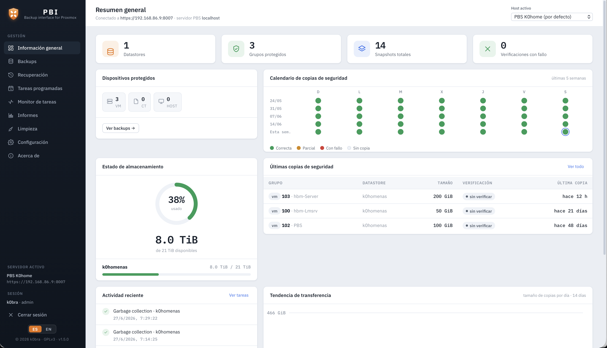
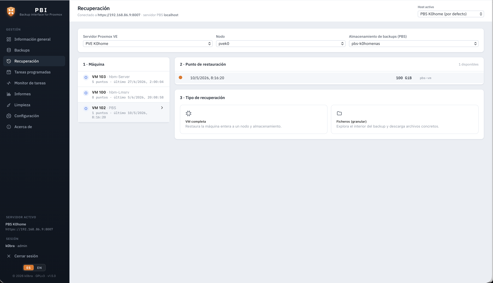
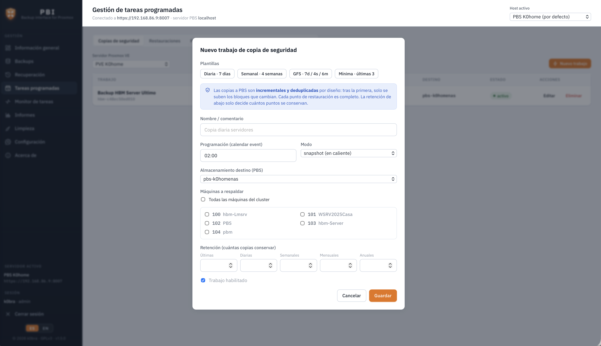

# PBI

Interfaz web para gestionar **Proxmox Backup Server (PBS)**: ver el estado de los
backups, gestionar tareas programadas (prune / verificación / sincronización),
monitorizar tareas en ejecución y extraer informes.


El **backend** actúa como proxy seguro: resuelve el certificado autofirmado de PBS,
guarda las credenciales solo en el servidor y soporta los dos modos de autenticación
de PBS (API token o usuario/contraseña).

El acceso al panel está protegido con **usuario y contraseña** (y **2FA opcional**);
en el primer arranque se crea la cuenta de administrador. Los servidores PBS se dan de
alta de forma **persistente** desde la sección **Configuración**, y se elige el **host
activo** desde el selector de la barra superior.

La interfaz está disponible en **español e inglés**: un selector **ES/EN** en la barra
lateral cambia todo el idioma al vuelo (detecta el del navegador en el primer arranque y
recuerda tu elección).

## Capturas y ejemplos

### Informes y notificaciones

Ejemplos generados con datos ficticios por el propio motor de PBI (ábrelos en el
navegador para verlos tal cual los produce/envía la herramienta):

- 📄 **Informe mensual de copias** — [versión HTML](docs/examples/informe-mensual.html) · [versión PDF](docs/examples/informe-mensual.pdf)
- ✉️ **Notificación por email** — [copia correcta](docs/examples/notificacion-correcta.html) · [copia fallida](docs/examples/notificacion-fallo.html)

El informe incluye calendario mensual de copias, estado de almacenamiento, detalle por
máquina, incidencias del periodo y un bloque de cumplimiento (ISO 27001 / ENS) válido
para auditoría.

### Capturas de pantalla

Las capturas se colocan en `docs/screenshots/` (ver la [guía](docs/screenshots/README.md)
con los nombres de archivo recomendados). Una vez añadidas, descomenta este bloque:

<!--
| Panel principal | Copias de seguridad | Recuperación |
|:---:|:---:|:---:|
|  |  |  |
| **Tareas programadas** | **Informes** | **Configuración · 2FA** |
|  |  |  |
-->

## Instalación

### Opción A — Paquete `.deb` (recomendado)

Pensado para instalar en el propio PBS o en cualquier Debian/Ubuntu. **Incluye todo lo
necesario** (runtime de Node embebido, servicio systemd y HTTPS con certificado
autofirmado): no hace falta instalar Node ni ninguna otra dependencia.

```bash
sudo dpkg -i pbi_<version>_amd64.deb
```

Al terminar, el instalador muestra la **URL de acceso** (por defecto
`https://IP_DEL_SERVIDOR:8800`). El servicio se gestiona con systemd:

```bash
systemctl status pbi      # estado
journalctl -u pbi -f      # logs en vivo
```

La configuración está en `/etc/pbi/pbi.env` y los datos persistentes (hosts, usuarios,
etc.) en `/var/lib/pbi`.

### Opción B — Desde el código fuente (desarrollo)

Requisitos: **Node.js 18+** (desarrollado con v22).

```bash
npm install        # instala server + web (workspaces)
npm run dev        # levanta backend (:4000) y frontend (:5173)
```

Abre **http://localhost:5173**. En el primer acceso crearás la cuenta de administrador;
después te llevará a **Configuración** para añadir tu primer servidor PBS.

Para producción desde código: `npm run build` (compila el frontend) y luego `npm start`
(el backend sirve la API y el frontend compilado).

## Añadir un host PBS

Desde la sección **Configuración → Añadir host**, rellena:

- **Host**: `https://TU_HOST_PBS:8007`
- **Nodo**: nombre del nodo PBS (normalmente el hostname del servidor; por defecto
  `localhost`). Lo necesita el *Monitor de tareas*.
- **Modo de autenticación**:
  - **API Token** (recomendado): créalo en PBS en *Configuration → Access Control →
    API Tokens*. Introduce el *Token ID* (`usuario@realm!nombre`) y el *Secret*.
  - **Usuario / Contraseña**: el backend hace login contra PBS y gestiona el
    ticket + token CSRF automáticamente (con renovación).
- **Verificar TLS**: desmárcalo si el certificado es autofirmado (lo habitual en PBS).

Usa **⚡ Probar** para validar la conexión antes de guardar. Puedes guardar varios
hosts y cambiar entre ellos con el selector de la barra superior; uno se marca como
**predeterminado**.

Los hosts se guardan en `server/data/hosts.json` (persistente entre reinicios).

> **Permisos en PBS:** para solo lectura basta el rol `DatastoreAudit`. Para crear/
> modificar/lanzar jobs se necesitan permisos de administración (`DatastoreAdmin`,
> `Sys.Audit`, etc.) según la operación.

## Funcionalidades

- **Resumen**: uso de almacenamiento por datastore, nº de snapshots, verificaciones
  fallidas, tareas por tipo y tareas en ejecución.
- **Backups**: explorador de snapshots por datastore con filtro y estado de
  verificación. Exportación a CSV.
- **Tareas programadas (jobs)**: listar, **crear, editar, eliminar y lanzar**
  manualmente jobs de *prune*, *verify* y *sync*.
- **Monitor de tareas**: historial con auto-refresco cada 5 s, filtro "solo en
  ejecución" y visor de log por tarea (se actualiza en vivo si la tarea sigue
  corriendo).
- **Informes**: resumen ejecutivo (tasa de éxito, fallos) y descargas CSV de
  snapshots y de historial de tareas.

## Estructura del proyecto

```
pbmdev/
├─ package.json            # workspaces + scripts (dev / build / start)
├─ server/                 # backend Node + Express
│  ├─ .env(.example)       # configuración del servidor (puerto, CORS…)
│  ├─ data/hosts.json      # hosts PBS guardados (generado, persistente)
│  └─ src/
│     ├─ index.js          # arranque del servidor
│     ├─ config.js         # carga de configuración
│     ├─ pbsClient.js      # cliente HTTP a la API de PBS (TLS, token, ticket, timeout)
│     ├─ pbsService.js     # capa de datos hacia PBS
│     ├─ hostStore.js      # almacén persistente de hosts PBS
│     ├─ authResolver.js   # resuelve el host activo + caché de tickets
│     └─ routes/           # hosts, api, reports
└─ web/                    # frontend React + Vite
   └─ src/
      ├─ App.jsx           # navegación + selector de host
      ├─ api.js            # cliente de la API + formateadores
      └─ components/       # Settings, Dashboard, Backups, Jobs, Tasks, Reports
```

## Scripts

| Comando            | Qué hace                                            |
|--------------------|-----------------------------------------------------|
| `npm run dev`      | Backend + frontend en modo desarrollo               |
| `npm run dev:server` / `dev:web` | Solo uno de los dos                    |
| `npm run build`    | Build de producción del frontend (`web/dist`)       |
| `npm start`        | Arranca solo el backend (sirve la API)              |

## Notas y siguientes pasos

- Los secretos (token secrets de PBS/PVE y contraseña SMTP) se guardan **cifrados en
  reposo** (AES-256-GCM) en los ficheros de datos (`600`). La clave se deriva del
  `SESSION_SECRET` del servidor —que en la instalación `.deb` vive en `/etc/pbi/pbi.env`,
  **separado** del directorio de datos `/var/lib/pbi`—, de modo que una copia del
  directorio de datos no basta para descifrarlos. La API nunca devuelve los secretos
  (se enmascaran). Si cambias `SESSION_SECRET`, los secretos ya guardados habrá que
  reintroducirlos.
- Los tickets del modo usuario/contraseña se cachean **en memoria** y se renuevan
  automáticamente; las peticiones a PBS tienen un timeout de 15 s.
- Los endpoints de **ejecución manual** de jobs usan `/admin/{kind}/{id}` (best-effort
  según la API de PBS); conviene validarlos contra tu versión concreta de PBS.
- Para producción: servir el frontend compilado (`npm run build`) detrás del propio
  backend o de un reverse proxy con HTTPS, y restringir el acceso al panel.

## Licencia

PBI es software libre, bajo la **Licencia Pública General de GNU v3 (GPLv3)**.
El texto completo está en el fichero [`LICENSE`](LICENSE).

Copyright © 2026 k0bra.

Este programa se distribuye con la esperanza de que sea útil, pero **SIN NINGUNA
GARANTÍA**. El uso de la herramienta —en especial las operaciones de restauración
y eliminación de copias— es responsabilidad exclusiva del usuario. Verifica siempre
tus copias y realiza pruebas de restauración periódicas.

### Marcas y no afiliación

«Proxmox», Proxmox Backup Server y Proxmox VE son marcas de Proxmox Server Solutions
GmbH. **PBI es un proyecto independiente y no oficial, sin afiliación, patrocinio ni
respaldo de Proxmox Server Solutions GmbH.** Dichos nombres se usan únicamente con
fines descriptivos y de interoperabilidad. El logotipo de PBI es una creación original.
